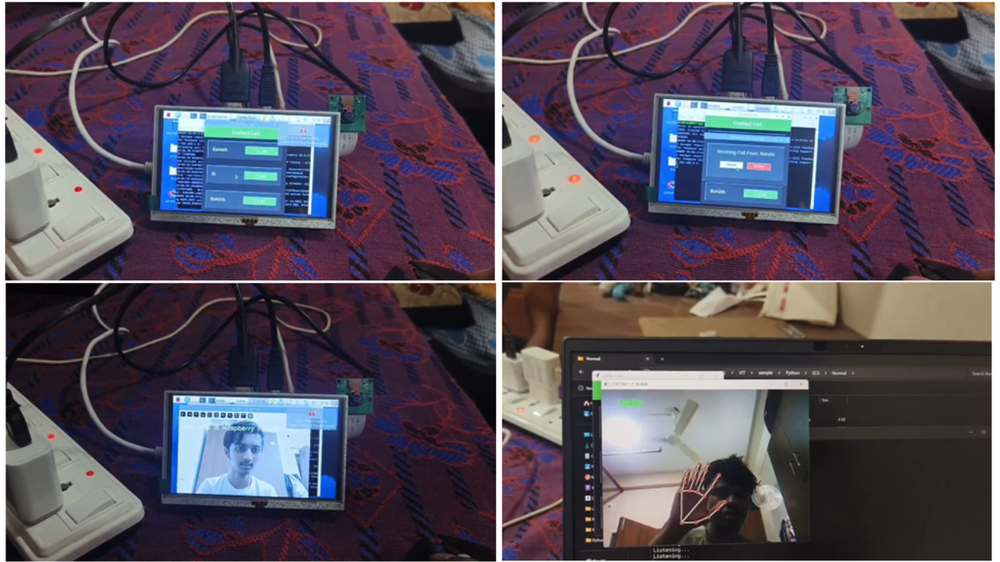

Video Call Intercom Based on IP System with Vibration Sensor

Overview

This project presents an integrated hardware and software solution that enables smooth communication between deaf users and others. Built as part of the Engineering Clinics Course (ECS) at VIT-AP University and inspired by a Smart India Hackathon (SIH) problem statement, the system establishes video calls over a local IP network at zero communication cost. By combining a Raspberry Pi setup with Python-based software, it offers real-time sign language translation and speech-to-text support for inclusive, effortless interaction.

Key Features
a. Video calling over local network

Operates on Ethernet or Wi-Fi using static IPs and Python socket programming.

Supports real-time video communication between devices designed for deaf users and regular desktops or laptops.

b. Sign language recognition

Uses Mediapipe to detect hand landmarks and calculate angles for each gesture.

Matches these angles with a pre-trained dataset stored in a Pickle file to identify 24 commonly used words and phrases.

Displays the recognized words on the user interface for instant understanding.

c. Speech-to-text conversion

Captures spoken input and converts it into text, making conversations clearer and easier to follow.

d. Hardware integration

Built around a Raspberry Pi 4 equipped with:

XPT2046 5-inch touchscreen

Camera module for live video capture

Vibration motor connected through GPIO pins to signal incoming calls

e. Simple and accessible interface

A Tkinter-based interface shows all connected devices on the local network and lets users initiate or receive calls with a tap.

System Workflow

i. Server management
A FastAPI server keeps track of connected devices and their IP addresses.

ii. Video communication
Devices exchange video frames and data packets via Python sockets for low-latency streaming.

iii. Gesture interpretation
Mediapipe continuously monitors hand movements, compares angles with the dataset, and sends recognized words to the UI.

iv. Call alerts
The vibration motor activates whenever an incoming call is detected, ensuring immediate notification for deaf users.

Hardware Requirements

Raspberry Pi 4

XPT2046 5-inch touchscreen

Camera module

Vibration motor

Local network connection (Ethernet or Wi-Fi)

Software Stack

Language: Python

Core libraries and tools: FastAPI, OpenCV, Mediapipe, Tkinter, Socket, GPIO
## Images

